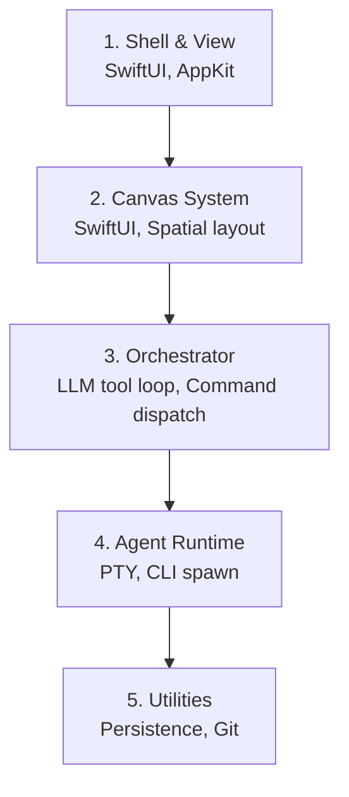

<!-- ORCA_CONTEXT_ID: orca-ctx-276bb6dc46d50381 -->
<!-- ORCA_WORKSPACE: /Users/ghost/Desktop/Projects/pip-mascot -->
<!-- ORCA_ANALYZED_AT: 2026-07-01T04:27:27Z -->

# Project context

> PNG · macOS · 5 layers

**Context ID:** `orca-ctx-276bb6dc46d50381` · **Workspace:** `/Users/ghost/Desktop/Projects/pip-mascot` · **Analyzed:** 2026-07-01T04:27:27Z

Xcode organized in 5 layers: Shell & View → Canvas System → Orchestrator → Agent Runtime → Utilities.

## Tech stack
**Languages:** PNG, Swift, Python, WEBP
**Platforms:** macOS

**Hierarchy** (presentation → core):
1. **Shell & View** — SwiftUI, AppKit · _OrcaCoderApp, Views, Chrome_
2. **Canvas System** — SwiftUI, Spatial layout · _InfiniteCanvasView, CanvasGridLayout_
3. **Orchestrator** — LLM tool loop, Command dispatch · _Orchestrator, BridgeOrchestratorPipeline_
4. **Agent Runtime** — PTY, CLI spawn · _AgentExecutor, PTYSession_
5. **Utilities** — Persistence, Git, File I/O · _PersistenceStore, GitIntegration_

## Stack hierarchy
- **Shell & View** — SwiftUI, AppKit · OrcaCoderApp, Views, Chrome
- **Canvas System** — SwiftUI, Spatial layout · InfiniteCanvasView, CanvasGridLayout
- **Orchestrator** — LLM tool loop, Command dispatch · Orchestrator, BridgeOrchestratorPipeline
- **Agent Runtime** — PTY, CLI spawn · AgentExecutor, PTYSession
- **Utilities** — Persistence, Git, File I/O · PersistenceStore, GitIntegration

## Architecture

## Infrastructure
- **Platforms:** macOS
- **Scripts:** `scripts/` test & automation harness

## User flow
1. Open workspace → 2. Assess stack & architecture → 3. Command orchestrator → 4. Execute → 5. Verify

## Context binding
Only trust `.orca/project-context.md` when its `ORCA_CONTEXT_ID` matches `orca-ctx-276bb6dc46d50381` and workspace is `/Users/ghost/Desktop/Projects/pip-mascot`. If they differ, the file is stale — re-read after switching folders or run project analysis.

_Workspace:_ `/Users/ghost/Desktop/Projects/pip-mascot`
_Context ID:_ `orca-ctx-276bb6dc46d50381`
_Analyzed:_ 2026-07-01T04:27:27Z